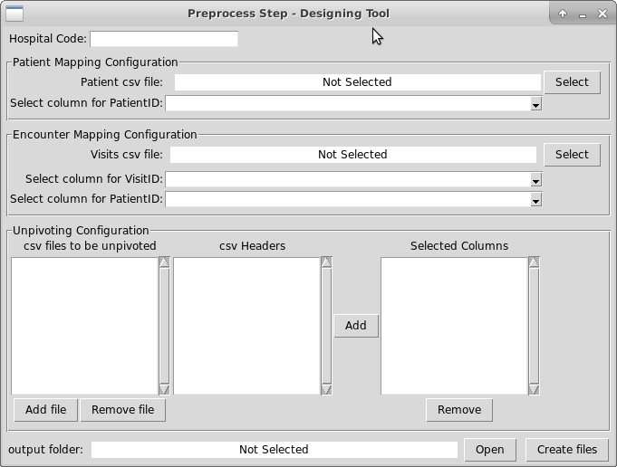

# ehr-mapping-design-template

[](http://rc.aueb.gr/el/static/home) [](https://www.humanbrainproject.eu/en/follow-hbp/news/category/sp8-medical-informatics-platform/)

This is a EHR mapping design template containing the folders and scripts needed to configure and run the EHR [DataFactory pipeline](https://github.com/HBPMedical/ehr-datafactory-template.git) on a hospital node. Please refer to [DataFactory's User Guide](https://mip.ebrains.eu/documentation/User%20Manuals/6) for further details about DataFactory and its mapping-task designing principles.

## Requirements

- docker (v18)
- docker-compose (v1.22 - v1.8)
- python3 (v3.5 or greater), python3-pip, python3-tk 
- [MIPMAP](https://github.com/HBPMedical/MIPMap)

Datafactory User must be in the user group “docker”, so the scripts will run without the “sudo” command.
To do that, follow the below instructions:
Add the docker group if it doesn't already exist:

```shell
 sudo groupadd docker
 ```

Add the connected user "$USER" to the docker group. Change the user name to match your preferred user if you do not want to use your current user:

```shell
sudo gpasswd -a $USER docker
```

Either do a newgrp docker or log out/in to activate the changes to groups.
You can use `$ docker run hello-world`  to check if you can run docker without sudo.

### Reserved ports
* 45432: for `demo_postgres` postgreSQL container
 
 This port may change in the configuration. Please edit `config.sys` file if you want to change the default port. 

## Setup and sample data preparation

1. Clone this repo
   
2. Edit the `config.sys` file, if you want to change the default settings.
  
3. Execute the `build_postgres.sh` script to create a docker container with the name `demo_postgres` with the 3 databases which are needed by EHR DataFactory pipeline. These databases are:

- mipmap
- i2b2_capture
- i2b2_harmonized

```shell
sh build_postgres.sh
```

**Caution!** If `demo_postgres` container is already exist the script will drop the 3 databases and will create new ones. Also make sure that `demo_postgres` container is running, otherwise the script will fail. In case the container exist and is stopped, you must restart the container.

3. Place the hospital csv files into the `source` folder. It is a good practice, for privacy reasons, not using the original csv hospital files containing all the data, but work with copy of those files having the same filenames and containing a limited number of rows (i.e. 15-40).

## Preprocess step configuration files

Create preprocessing configuration files in the `preprocess_step` folder by using the preprosess_tool GUI located in the `preprocess_tool` folder.

Launch the tool by giving in terminal:
```shell
cd preprocess_tool
python3 prepro_gui.py
```



In the **Patient Mapping Configuration** section we declare the csv file (located in the `source` folder, see step 3 of the sample data preparation section) that contains all the patients ID unique codes of the incomming EHR batch and we select the column that contains this code. 

In the **Encounter Mapping Configuration** section we declare the csv file (located in the `source` folder, see step 3 of the sample data preparation section) that contains all the patients' visits ID unique codes of the incoming EHR batch and we select the column that contains this code and also the column that holds the unique patient's ID code.

In the **Unpivoting Configuration** Section we first select which csv files (located in the `source` folder, see step 3 of the sample data preparation section) we want to be unpivoted. Unpivoting a csv file is the action where the values of some columns in each row, are placed in multiple rows which share the same values of the "selected" columns. For example, let's say we have:

| Column1 | Column2 | Column3 | Column4|
|---------|---------|---------|--------|
|  Value1 | Value2  | Value3  | Value4 |

The unpivoted version with the columns 1 and 2 as "selected" columns will be:

| Column1 | Column2 | unPivoted | Value  |
|---------|---------|-----------|--------|
|  Value1 | Value2  | Column3   | Value3  |
|  Value1 | Value2  | Column4   | Value4  |


Moving on, we select for each file which columns will be selected.
And finaly we select the output folder where we want to save the configurations files (for example `preprocess_step`)

The final configurations files which are located in the `preprocess_step` folder, will be the following:

- encountermapping.properties
- patientmapping.properties
- run.sh
- selected<input_csv 1>.txt (columns that will **not** be unpivoted in the 1st input csv)
- unpivoted<input_csv 1>.txt (columns that will be unpivoted in the 1st input csv)
- ...
- selected<input_csv N>.txt
- upivoted<input_csv N>.txt

The total number of the configuration file will be **3 + 2N**, where **N** is the number of input csv files that needed to be unpivoted.

### Creation of the auxilary files and Testing the preprocessing configuration files

Before continuing to the next step (**Capture step configuration files**), which is the designing of the "capture" mapping task, we **must** create the auxilary csv files (Data Factory **STEP_2B**):

 -  EncounterMapping.csv
 -  PatientMapping.csv 
 -  and the unpivoted csv files 

In order to do that we give in the main mapping design folder:

```shell
  sh ingestdata.sh preprocess
```

Check folder “source” if the auxiliary files have been created. Open each file and check if it is not empty. 

If everything is ok, we are ready to go to the next step.


## Capture step configuration files

1. Update(or replace) the following csv files in `source` folder with metadata:
    - `hospital_metadata.csv` (metadata about hospital's raw input csv files)
    - `cde_metadata.csv` (metadata about the pathology data model)
2. Ensure that the auxiliary files created from the previous step are located in the `source` folder. 
3. Design the mapping task by using **MIPMAP** and save it in the main folder with the name `map.xml` 
4. Then run:

```shell
  sh templator.sh capture
````

The last script creates a template xml `map.xml.tmpl` file in the folder `capture_step`.

The final configurations files are located in the `capture_step` folder and are the following:

- map.xml.tmpl  
- run.sh

## Harmonization step configuration files

1. Design the mapping task by using **MIPMAP** and save it in the main folder with the name `mapHarmonize.xml`
2. Then run:

```shell
  sh templator.sh harmonize
```

The last script creates a template xml `mapHarmonize.xml.tmpl` file in the folder `harmonize_step`.

The final configurations files are located in the `harmonize_step` folder and are the following:
  
- mapHarmonize.xml.tmpl
- run.sh

## Testing EHR pipeline

The steps are numbered according to the **MIP DATA FACTORY Data Processing User Guide** document

### Step_2B- preprocess step

In the main folder we run:

```shell
  sh ingestdata.sh preprocess
```

**Check** if the auxiliary files (EncounterMapping.csv, PatientMapping,csv and the unpivoted csv's) are created in the `source` folder

### Step_3A - capture step

Caution! Auxilary files must be created first by the preprocessing step.

In the main folder we run:

```shell
  sh ingestdata.sh capture
```

**Check** if the `i2b2_capture` database is populated with data in the postgres container.

### Step_4 - harmonization step

In the main folder we run:

```shell
  sh ingestdata.sh harmonize
```

**Check** if the `i2b2_harmonized` database is populated with data in the postgres container. Also, we could run the `export_step` and check if the flattened csv file is correct. 

If every of the above steps have run successfully in our local machine, we are ready to upload the EHR mapping configuration files into the actual DataFactory installation on Hospital node.

### Step_5B - export step (optional)

By inspecting the flattened csv file created in this step, we can gain more confidence on the validity of our EHR mapping configuration files (mapping tasks xml files).
We sugest to run the export step multiple times using different flattening methods.

```shell
  sh ingestdata.sh export <flatening method>
```

`flattening method` we declare the csv flattening method. The choices are the following:

  1. 'mindate': For each patient, export one row with all information related to her first visit
  
  2. 'maxdate': For each patient, export one row with all information related to her last visit
  
  3. '6months': For each patient, export one row with the information according to the 6-month window selection strategy defined by CHUV for clinical data related to MRI's. The criteria in detail:
      - For a patient to have a row in the output CSV she has to have an MRI and a VALID Diagnosis (etiology1 !=“diagnostic en attente” and etiology1 != “NA”) in a 6-month window to the MRI. If there are more than one MRIs choose the first one. If there are more than one Diagnosis, choose the closest VALID to the MRI.
      - The age and the visit date selected are the ones of the Diagnosis.
      - Having information about MMSE and MoCA is optional. Has to be within a 6-month window to the Diagnosis date.
      
  4. 'longitude': For each patient, export all available information.
